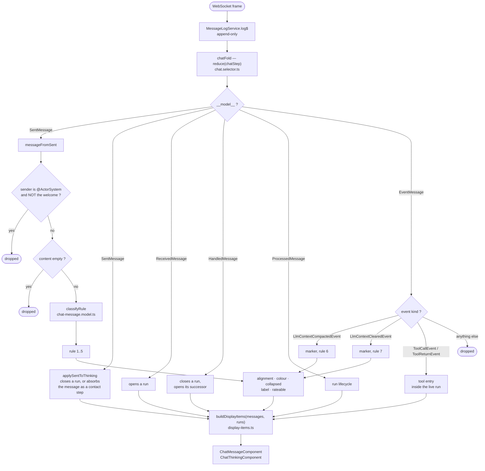
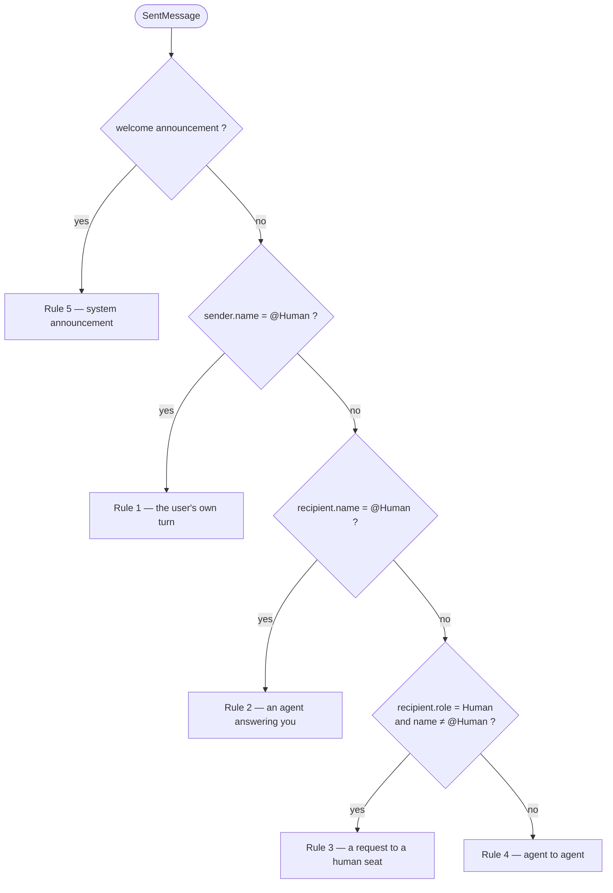
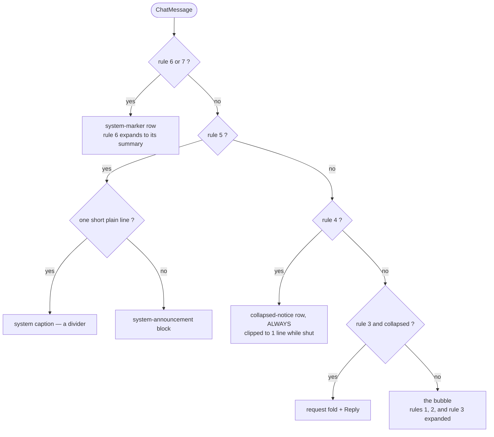

# How a message becomes a row

Every visible thing in the transcript comes from one append-only event log, fed by one WebSocket.
This document is the map from a frame on that socket to a row on the screen: what is admitted, what
it is classified as, what that classification decides, and what finally draws it.

It lives beside the code rather than in the architecture bundle
(`akgentic-framework/_bmad-output/akgentic-frontend/architecture/`) on purpose. The bundle records
*decisions* — why the surface is shaped this way. This records *mechanism*, and mechanism changes
with the files it describes; a copy one repository away is a copy that goes stale without anybody
noticing.

Everything below is pure, synchronous and deterministic given the log. There is no timer, no
`Date.now()`, no DOM read and no out-of-order correction anywhere in the chain.

## The whole chain

## Stage 1 — admission

`messageFromSent` refuses two kinds of frame outright, and the order matters:

1. **An `@ActorSystem` sender**, unless the frame is the welcome announcement. `@ActorSystem` is the
   transport listener; its envelopes are plumbing. The welcome is the one structural exception,
   because it arrives on that envelope and is genuinely addressed to the user.
2. **Empty content.** A `SentMessage` with no body is a routing artefact, not something anybody said.

A frame that survives both is classified. A frame that does not is dropped silently — it still
reaches the Messages tab, which shows the raw log; it just never becomes a turn.

## Stage 2 — classification

`classifyRule` is **first-match-wins**, and the order is load-bearing:

**Why rule 5 is tested first.** The welcome announcement's *outer* recipient is `@Human`, so without
the first-match it would classify as rule 2 — and rendering it as one would expose the
`@ActorSystem` transport envelope as if it were a speaker. Rule 5 also reads the *inner*
`message.sender` (`@Orchestrator`) where every other rule reads the outer one; it is the single
asymmetry in the classifier.

**Why rule 3 is not keyed on a name.** `recipient.role === 'Human'` with a name that is not the
entry point is a human *seat* that is not you — a proxy, a Send-as, a routed reply. Keying on the
name instead would collapse every multi-human deployment into rule 4.

Rules **6** and **7** never go through the classifier. They are synthetic markers built directly
from `EventMessage` payloads — 6 is the compaction fold, whose body *is* the generated summary; 7 is
the one-line "conversation cleared". Neither has a real sender or recipient.

## Stage 3 — what the rule decides

The rule is the only input to all five presentational facts. Nothing downstream re-derives them.

| Rule | What it is | Alignment | Fill | Collapsed | Label | Rateable |
|---|---|---|---|---|---|---|
| 1 | the user's own turn | right | `--akg-surface` | no | `You` | no |
| 2 | an agent answering you | left | transparent | no | sender | **yes** |
| 3 | a request to a human seat | left | transparent | **yes** | `sender ⇒ recipient` | **yes** |
| 4 | agent to agent | left | transparent | **yes** | `sender ⇒ recipient` | **yes** |
| 5 | system announcement | left | transparent | no | `System message` | no |
| 6 | compaction marker | — | — | **yes** | `Summarized N messages` | no |
| 7 | clear marker | — | — | no | `Conversation cleared` | no |

Two of these are worth stating in words, because they are the ones that surprise:

- **Only rule 1 has a fill.** An agent's turn sits directly on the page, unbordered and unpadded, so
  a long exchange reads as a document rather than as a column of tinted boxes. The user's own turn
  keeps its bubble, and that is what carries the left/right rhythm now that nothing else is tinted.
  The other rules are `transparent` rather than absent so a deployment can re-point them.
- **Rateability is exhaustive over the union.** `isRateable` switches on `MessageRule` with no
  `default` arm, so adding a rule stops `rateable.ts` compiling until the new kind is stated to be
  an answer or excluded. That compile error is the only thing standing between a new message kind
  and being silently rateable.

## Stage 4 — the merge

`buildDisplayItems(messages, runs)` produces the list the template iterates. Three things happen,
in this order:

1. **Contact steps are dropped.** A rule-4 message that a run absorbed is already on screen *inside*
   that run's fold; its own row would be the same message twice.
2. **Runs are appended** as `thinking` items and the whole list is **sorted chronologically**, with
   messages before thinking bubbles on a tie.
3. **Day separators are inserted** between calendar days. A separator is chrome, not content: no
   sender, not selectable, not collapsible, and never counted as a message — the scroll model and
   the "New messages" pill are computed from the classified stream alone.

> **The trap.** The exclusion set in step 1 is derived from the `runs` array this function is
> *handed*, not from a global one. Pass the global run list while rendering a subset — which is
> exactly what the sub-agent reader does — and the arithmetic inverts: messages are deleted from the
> screen with no fold left to show them in. The symptom is silent and looks like data loss. Keep
> exclusion and rendering derived from one and the same array.

**Which runs belong to which transcript** is decided by the *sender of the run's anchor message*,
never by which agent ran. `agent_id` says who ran; it cannot say on whose behalf. The main
transcript takes the runs anchored on a human's message; the reader takes the runs anchored on the
open agent's.

## Stage 5 — the render

One component, `ChatMessageComponent`, renders every rule. The gates are mutually exclusive by
construction:

Two of these gates carry a decision that is easy to undo by accident:

- **Rule 4 is always the one-line row**, open or shut. It used to *swap* for a full bubble when
  expanded, which is two shapes for one message — and during a swap both are in flow and their
  heights add, which is what defeated every attempt to animate the fold. Opening it now only stops
  clipping the text. Anything derived from `collapsed` on this row must therefore say which of the
  two it means: `isNoticeFold()` is "is this a rule-4 row" and is true either way, while the host's
  `quiet-line` spacing needs "is it still *shut*".
- **Nothing in the component may memoise anything derived from `collapsed`.** The panel toggles it
  *in place* on the message object, so the object's identity never changes and a signal input does
  not notify. `isRequestFold()` and `isNoticeFold()` are methods rather than `computed()` for that
  reason: a method is re-evaluated per change-detection pass, like the template expression beside
  it, so the pair stays mutually exclusive. The deeper fix is for the panel to replace the message
  rather than mutate it.

## Where the colour comes from

Orthogonal to the rules, and deliberately so: an agent's colour is a fact about the **roster**, not
about any message. `agentColours(nodes, palette)` in `features/process/selectors/agent-colour.ts`
assigns each addressable
agent one stop of `--akg-graph-category-1..10` in discovery order, skipping the tools and the human
so neither consumes a stop. The hierarchy graph, the transcript's speaker mark and name pills, and
the inspector's member tiles all call that one function over the same node list — which is what
makes "the blue one" mean the same agent in all three.

On a rule-4 row it does one more job: a named party is offered as a control **exactly when the
lookup gave it a colour**. A `#NotificationTool` in the subject position has no colour, so it is
drawn as plain text and ignores a click, with no second rule anywhere saying so.

## The files

Paths are relative to `src/app/`. The split is deliberate: `components/` holds the views,
`features/` holds the logic those views read — see the *Layout* section of the README.

| File | What it owns |
|---|---|
| `features/process/selectors/chat.selector.ts` | the fold; run lifecycle; tool entries; contact absorption |
| `features/process/selectors/chat-message.model.ts` | `classifyRule`, `buildLabel`, alignment, fill, collapse, markers |
| `features/process/selectors/rateable.ts` | whether a rule is an answer that can be judged |
| `features/process/selectors/display-items.ts` | the merge, the sort, run scoping |
| `features/process/selectors/day-separator.ts` | the calendar-day arithmetic |
| `features/process/selectors/actor-kind.ts` | tool / human / addressable-agent predicates |
| `features/process/selectors/agent-colour.ts` | one colour per agent, shared by three surfaces |
| `components/process/components/chat/chat-message.component.*` | every rule's rendering |
| `components/process/components/chat/chat-thinking.component.*` | the activity fold |
